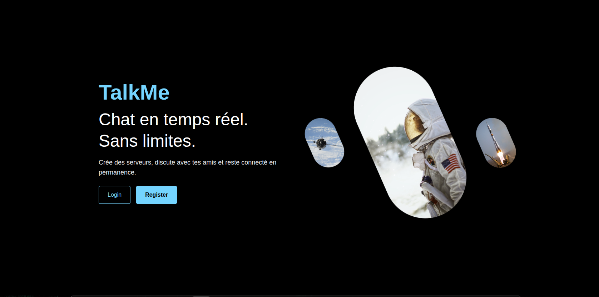
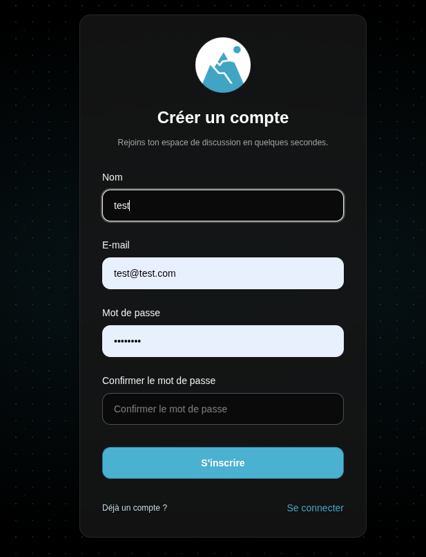

<p align="center">
  
</p>

<p align="center">
  
  
  
  
</p>

---

<div align="center">
  
  
</div>

<br />

**TalkMe** est une plateforme de chat en ligne inspirée de Discord, développée dans le cadre du **pré-MSc Epitech**.  
Le projet permet de communiquer en temps réel au sein de **serveurs** et **channels**, avec une architecture full‑stack moderne.

---

## 📑 Sommaire

* [Fonctionnalités](#-fonctionnalités)
* [Architecture](#-architecture)
* [Technologies utilisées](#-technologies-utilisées)
* [Installation](#-installation)
* [Utilisation](#-utilisation)
* [Authentication](#-Authentication)
* [Contributeurs](#-contributeurs)

---

## ⚙️ Fonctionnalités

- Créer un compte permettant de s’identifier et de conserver un historique des conversations
- Créer des serveurs afin d’organiser les échanges
- Créer des channels pour discuter de différents thèmes dans un même serveur
- Ajouter des membres aux channels
- Discuter en temps réel avec les membres

---

## 🏗️ Architecture

```
/apps
├───/back
│   ├── src/
│   │   ├── auth/
│   │   ├── channel/
│   │   ├── chat/
│   │   ├── generated/
│   │   ├── member/
│   │   ├── member-channel/
│   │   ├── messages/
│   │   ├── prisma/
│   │   ├── servers/
│   │   ├── user/
│   │   └── main.ts
│   ├── prisma.config.ts
│   ├── tsconfig.json
│   ├── package.json
│   └── package-lock.json
│
└───/front
    ├── app/
    │   ├── auth/
    │   │   ├── login/
    │   │   └── register/
    │   ├── chat/
    │   │   ├── [serverId]/
    │   │   │   ├── [channelId]/
    │   │   │   └── addchannel/
    │   │   ├── addservers/
    │   │   └── navbar/
    │   ├── components/
    │   ├── config/
    │   ├── lib/
    │   └── page.tsx
    ├── public/
    ├── next.config.ts
    └── tsconfig.json
```

---

## 🧰 Technologies utilisées

### 🎨 Frontend
- React
- Next.js
- TailwindCSS
- Socket.io-client

### ⚙️ Backend
- NestJS
- PostgreSQL
- Prisma
- Better Auth
- Socket.io

### 🧪 Outils
- TurboRepo
- Supabase
- Postman

---


## 🧩 Installation

### 1️⃣ Cloner le dépôt et installer les dépendances

```bash
git clone https://github.com/EpitechMscProPromo2028/T-JSF-600-MPL_11.git
cd T-JSF-600-MPL_11
pnpm install
```

### 2️⃣ Créer la base de données et les tables

```bash
cd packages/type
pnpx prisma generate
pnpx prisma db push
```

### 3️⃣ Lancer le projet

```bash
turbo dev
```

### 4️⃣ Configurer les variables d’environnement

Créer un fichier `.env` à la racine du dossier **database** :

```env
DATABASE_URL=
```

Créer un fichier `.env` à la racine du dossier **back** :

```env
LOCAL_FRONT_URL=
NETWORK_FRONT_URL=
PORT=
DATABASE_URL=
```

Créer un fichier `.env.local` à la racine du dossier **front** :

```env
NEXT_PUBLIC_API_HTTP=
```

---

## 🚀 Utilisation

- Frontend : http://localhost:3000
- Backend : http://localhost:3001

---

## 🔐 Authentication

| Method | Endpoint | Description |
|--------|----------|-------------|
| `POST` | `/auth/signup` | Create a new user account |
| `POST` | `/auth/login` | Authenticate and get tokens |
| `POST` | `/auth/logout` | Invalidate tokens |
| `GET` | `/me` | Get current user information |

### 🏘️ Servers (Communities / Guilds)

| Method | Endpoint | Description |
|--------|----------|-------------|
| `POST` | `/servers` | Create a new server |
| `GET` | `/servers` | List user's servers |
| `GET` | `/servers/{id}` | Get server details |
| `PUT` | `/servers/{id}` | Update server |
| `DELETE` | `/servers/{id}` | Delete server |
| `POST` | `/servers/{id}/join` | Join a server |
| `DELETE` | `/servers/{id}/leave` | Leave a server |
| `GET` | `/servers/{id}/members` | List server members |
| `PUT` | `/servers/{id}/members/{userId}` | Update member role |

### 💬 Channels

| Method | Endpoint | Description |
|--------|----------|-------------|
| `POST` | `/servers/{serverId}/channels` | Create a channel |
| `GET` | `/servers/{serverId}/channels` | List server channels |
| `GET` | `/channels/{id}` | Get channel details |
| `PUT` | `/channels/{id}` | Update channel |
| `DELETE` | `/channels/{id}` | Delete channel |
| `POST` | `/channels/{id}/join` | Join a channel |
| `DELETE` | `/channels/{id}/leave` | Leave a channel |

### 📨 Messages

| Method | Endpoint | Description |
|--------|----------|-------------|
| `POST` | `/channels/{id}/messages` | Send a message |
| `GET` | `/channels/{id}/messages` | Get channel message history |
| `DELETE` | `/messages/{id}` | Delete message |

---

## 🔌 WebSocket (Socket.IO)

Communication temps réel via **Socket.IO**.

**Événements principaux :**
- `joinRoom` – rejoindre un channel
- `leaveRoom` – quitter un channel
- `typing` – indicateur de saisie
- `stopTyping` – fin de saisie
- `chatToServer` – envoi d’un message
- `messageUpdated` – modification d’un message
- `messageDelete` – suppression d’un message


## 👥 Contributeurs

| Nom | Rôle |
|----|----|
| Victor Galian | Développeur |
| Bastien Tiffy | Développeur |
| Cyril Delly | Développeur |
| Louis Bousquet | Développeur |

---

<p align="center">
  
</p>
